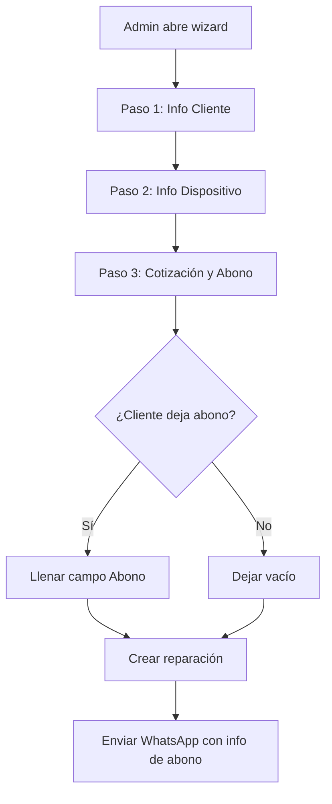
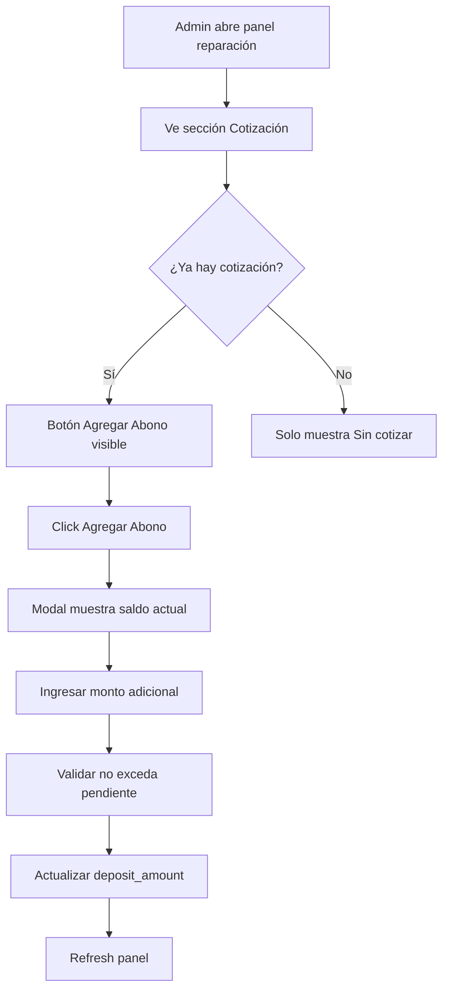
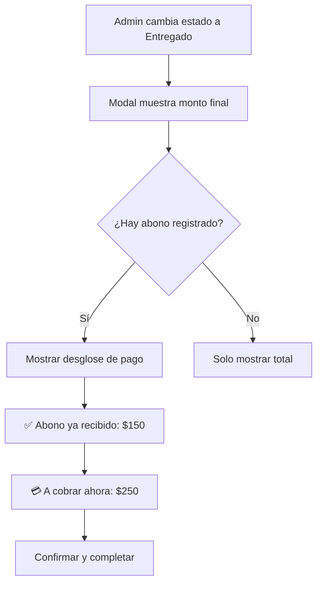

# 💰 Sistema de Abonos y Pagos Parciales - Guía Completa

## 📋 Índice
1. [Descripción General](#descripción-general)
2. [Cambios en la Base de Datos](#cambios-en-la-base-de-datos)
3. [Flujo de Trabajo](#flujo-de-trabajo)
4. [Implementación por Módulos](#implementación-por-módulos)
5. [Despliegue y Pruebas](#despliegue-y-pruebas)

---

## 🎯 Descripción General

El sistema de abonos permite registrar pagos parciales cuando un cliente deja un anticipo al momento de registrar su equipo, o agregar abonos posteriormente. El sistema calcula automáticamente el saldo pendiente y muestra esta información en:

- ✅ Mensajes de WhatsApp al cliente
- ✅ Panel de administración
- ✅ Modal de entrega
- ✅ Reportes financieros (cuando se implemente)

### Ejemplo de Uso
```
Cliente trae iPhone 14 para reparación
Cotización: $400
Abono inicial: $150
Saldo pendiente: $250 (calculado automáticamente)

Al finalizar la reparación:
- El sistema recuerda que ya hay $150 pagados
- Solo se debe cobrar $250 al entregar
```

---

## 🗄️ Cambios en la Base de Datos

### SQL Script: `supabase/add_deposit_system.sql`

#### ⚠️ CORRECCIÓN CRÍTICA: device_password
Se detectó que **faltaba la columna `device_password`** en la base de datos. Aunque el formulario la pedía y el JavaScript intentaba guardarla, nunca se almacenaba. Esto impedía que los técnicos vieran el PIN/contraseña del dispositivo.

```sql
ALTER TABLE repairs 
ADD COLUMN IF NOT EXISTS device_password VARCHAR(100);
```

**Impacto:**
- ✅ Ahora se guardará el PIN/contraseña al registrar equipos
- ✅ Los técnicos podrán ver la contraseña en el modal de trabajo
- 🔧 **Esencial para que puedan acceder a los dispositivos**

#### Nuevas Columnas en `repairs`
```sql
ALTER TABLE repairs ADD COLUMN deposit_amount DECIMAL(12, 2) DEFAULT 0;
ALTER TABLE repairs ADD COLUMN remaining_balance DECIMAL(12, 2) DEFAULT 0;
ALTER TABLE repairs ADD COLUMN total_paid DECIMAL(12, 2) DEFAULT 0;
```

**Descripción:**
- `deposit_amount`: Suma total de abonos recibidos
- `remaining_balance`: Saldo pendiente (calculado automáticamente)
- `total_paid`: Total pagado incluyendo abonos y pago final

#### Trigger Automático
```sql
CREATE OR REPLACE FUNCTION calculate_remaining_balance()
RETURNS TRIGGER AS $$
BEGIN
    -- Calculate remaining balance
    NEW.remaining_balance := COALESCE(NEW.quote_amount, 0) - COALESCE(NEW.deposit_amount, 0);
    
    -- Ensure non-negative
    IF NEW.remaining_balance < 0 THEN
        NEW.remaining_balance := 0;
    END IF;
    
    RETURN NEW;
END;
$$ LANGUAGE plpgsql;
```

**¿Qué hace?**
- Se ejecuta ANTES de cada INSERT o UPDATE en `repairs`
- Calcula automáticamente `remaining_balance = quote_amount - deposit_amount`
- Garantiza que nunca sea negativo

#### Función RPC: `add_deposit`
```sql
CREATE OR REPLACE FUNCTION add_deposit(
    p_repair_id UUID,
    p_deposit_amount DECIMAL(12, 2)
)
RETURNS JSON AS $$
...
```

**Uso:**
```javascript
const { data, error } = await supabase.rpc('add_deposit', {
    p_repair_id: '123e4567-e89b-12d3-a456-426614174000',
    p_deposit_amount: 150.00
});
```

**Validaciones incluidas:**
- ✅ Monto debe ser positivo
- ✅ Abono no puede exceder el saldo pendiente
- ✅ La reparación debe existir

---

## 🔄 Flujo de Trabajo

### Escenario 1: Abono al Registrar Equipo



**Pasos específicos:**
1. Admin completa pasos 1 y 2 del wizard
2. En paso 3, ve:
   - Estado cotización: `Pendiente / Aproximada`
   - Monto cotización: `$400`
   - **💰 Abono recibido (opcional)**: `$150` ← NUEVO
3. Al crear, sistema:
   - Guarda `deposit_amount = 150`
   - Calcula `remaining_balance = 250` (automático vía trigger)
   - Envía WhatsApp mostrando: "Total: $400 | Abono: $150 | Pendiente: $250"

---

### Escenario 2: Agregar Abono Después



**Pasos específicos:**
1. Admin busca la reparación en el panel
2. En sección "Cotización", ve:
   ```
   Estado: Aproximada
   Monto: $400
   
   [Actualizar Cotización] [Agregar Abono]
   ```
3. Click en "Agregar Abono"
4. Modal muestra:
   ```
   Total cotizado: $400
   Abono actual: $150
   ─────────────────────
   Saldo pendiente: $250
   
   Monto del abono adicional: [___]
   Monto máximo: $250
   ```
5. Admin ingresa $100
6. Sistema actualiza: `deposit_amount = $250` (150 + 100)

---

### Escenario 3: Entrega Final con Abono



**Interfaz del modal:**
```
┌─────────────────────────────────────┐
│ Cambiar Estado a Entregado          │
├─────────────────────────────────────┤
│                                     │
│ ✅ Abono ya recibido: $150          │
│ 💳 A cobrar ahora: $250             │
│ ─────────────────────────────      │
│                                     │
│ 💰 Monto final cobrado al cliente   │
│ [___400___] (editable)             │
│                                     │
│ ⚠️ Este es el monto total que se   │
│ le cobró al cliente                │
│                                     │
│ [Cancelar]  [Guardar]              │
└─────────────────────────────────────┘
```

---

## 🛠️ Implementación por Módulos

### 1️⃣ Base de Datos (Supabase)

**Archivo:** `supabase/add_deposit_system.sql`

**Ejecutar en Supabase SQL Editor:**
```sql
-- Copiar y ejecutar todo el contenido del archivo
-- Verificar con:
SELECT column_name, data_type 
FROM information_schema.columns 
WHERE table_name = 'repairs' 
AND column_name IN ('deposit_amount', 'remaining_balance', 'total_paid');
```

**Resultado esperado:**
```
column_name       | data_type
------------------|-----------
deposit_amount    | numeric
remaining_balance | numeric
total_paid        | numeric
```

---

### 2️⃣ Formulario de Registro (HTML)

**Archivo:** `admin.html` (líneas ~7040)

**Cambio realizado:**
```html
<!-- ANTES: Solo cotización -->
<div class="form-row">
    <div class="form-group">
        <label>Estado cotización</label>
        <select name="quote_status">...</select>
    </div>
    <div class="form-group">
        <label>Monto cotización</label>
        <input type="number" name="quote_amount">
    </div>
</div>

<!-- DESPUÉS: Cotización + Abono -->
<div class="form-row">
    <!-- Same as above -->
</div>

<div class="form-group">
    <label class="form-label">💰 Abono recibido (opcional)</label>
    <input type="number" name="deposit_amount" placeholder="0" min="0" step="1000">
    <small class="form-hint">Si el cliente dejó un anticipo, ingrésalo aquí</small>
</div>
```

---

### 3️⃣ JavaScript - Crear Reparación

**Archivo:** `src/js/pages/admin.js` (función `submitRepairWizard`)

**Cambio realizado:**
```javascript
// Línea ~4140
const repairData = {
    shop_id: shopId,
    client_id: clientId,
    device_category: formData.device_category,
    device_brand: formData.device_brand,
    device_model: formData.device_model,
    // ... otros campos ...
    quote_status: formData.quote_status || 'pending',
    quote_amount: formData.quote_amount ? parseFloat(formData.quote_amount) : null,
    deposit_amount: formData.deposit_amount ? parseFloat(formData.deposit_amount) : null, // ← NUEVO
    tech_id: formData.technician_id || null,
    priority: parseInt(formData.priority) || 3
};
```

---

### 4️⃣ Panel de Reparaciones - Mostrar Abono

**Archivo:** `src/js/pages/admin.js` (función `renderRepairPanelBody`)

**Cambio realizado:**
```javascript
// Línea ~4310
<div class="panel-section">
    <h4>Cotización</h4>
    <div class="quote-info">
        <span class="badge">${formatQuoteStatus(repair.quote_status)}</span>
        <span class="quote-amount">${formatCurrency(repair.quote_amount)}</span>
    </div>
    
    <!-- NUEVO: Box de abono -->
    ${repair.deposit_amount && repair.deposit_amount > 0 ? `
        <div style="margin-top: 12px; padding: 12px; background: var(--success-bg);">
            <div>💰 Abono recibido: ${formatCurrency(repair.deposit_amount)}</div>
            <div>💳 Saldo pendiente: ${formatCurrency((repair.quote_amount || 0) - repair.deposit_amount)}</div>
        </div>
    ` : ''}
    
    <!-- Botones -->
    <div style="display: flex; gap: 8px;">
        <button id="btn-update-quote">Actualizar Cotización</button>
        ${repair.quote_amount > 0 ? `
            <button id="btn-add-deposit">Agregar Abono</button>
        ` : ''}
    </div>
</div>
```

---

### 5️⃣ Función Agregar Abono

**Archivo:** `src/js/pages/admin.js` (nueva función `addDeposit`)

**Ubicación:** Después de `updateQuote()`, antes de `updateClientData()`

**Lógica:**
```javascript
async function addDeposit(repair) {
    const currentDeposit = repair.deposit_amount || 0;
    const quoteAmount = repair.quote_amount || 0;
    const remainingBalance = quoteAmount - currentDeposit;
    
    // Crear modal con:
    // - Info actual (total, abono, pendiente)
    // - Input para monto adicional
    // - Validación: no exceder remainingBalance
    
    // Al guardar:
    await updateRepair(repair.id, {
        deposit_amount: currentDeposit + additionalDeposit
    });
}
```

**Event listener:**
```javascript
// Línea ~4445 en renderRepairPanelBody()
$('#btn-add-deposit')?.addEventListener('click', () => addDeposit(repair));
```

---

### 6️⃣ Modal de Entrega

**Archivo:** `src/js/pages/admin.js` (función `updateRepairStatus`)

**Cambio realizado:**
```javascript
// Línea ~4468
<div class="form-group" id="final-amount-group" style="display: none;">
    <label>💰 Monto final cobrado al cliente</label>
    
    <!-- NUEVO: Info de abono si existe -->
    ${repair.deposit_amount > 0 ? `
        <div style="background: var(--info-bg); padding: 12px;">
            <div>✅ Abono ya recibido: ${formatCurrency(repair.deposit_amount)}</div>
            <div>💳 A cobrar ahora: ${formatCurrency(remainingToPay)}</div>
        </div>
    ` : ''}
    
    <div style="background: var(--warning-bg);">
        ⚠️ Este es el monto total cobrado al cliente
    </div>
    
    <input type="number" id="final-amount-input" value="${repair.final_amount || repair.quote_amount}" />
</div>
```

---

### 7️⃣ WhatsApp - Mensaje de Registro

**Archivo:** `src/js/config.js` (plantilla `ADMIN_TO_CLIENT`)

**Cambio realizado:**
```javascript
// Línea ~160
ADMIN_TO_CLIENT: `✅ *¡RECIBIMOS TU EQUIPO!*
━━━━━━━━━━━━━━━━━━━━━

...

💰 *Cotización*
   {estadoCotizacion} - {monto}{depositInfo}  // ← Agregado {depositInfo}

━━━━━━━━━━━━━━━━━━━━━
...`
```

**Archivo:** `src/js/services/whatsappService.js` (función `sendToClientFromAdmin`)

**Cambio realizado:**
```javascript
// Línea ~118
const hasDeposit = repair.deposit_amount && repair.deposit_amount > 0;
const depositInfo = hasDeposit 
    ? `\n💰 *Abono recibido:* ${formatCurrency(repair.deposit_amount)}
       \n💳 *Saldo pendiente:* ${formatCurrency(repair.remaining_balance || 0)}`
    : '';

const variables = {
    local: shop?.name,
    codigo: repair.code,
    marca: repair.device_brand,
    modelo: repair.device_model,
    estadoCotizacion: getQuoteStatusLabel(repair.quote_status),
    monto: formatCurrency(repair.quote_amount),
    depositInfo: depositInfo,  // ← NUEVO
    trackingLink: `${window.location.origin}/track.html?token=${repair.tracking_token}`
};
```

---

### 8️⃣ WhatsApp - Mensaje de Finalización

**Archivo:** `src/js/services/whatsappService.js` (función `generateCompletionMessage`)

**Cambio realizado:**
```javascript
// Línea ~213
const hasDeposit = repair.deposit_amount && repair.deposit_amount > 0;
const finalAmount = repair.final_amount || repair.quote_amount || 0;
const depositAmount = repair.deposit_amount || 0;
const remainingToPay = Math.max(finalAmount - depositAmount, 0);

// Construir sección de pago
let paymentSection = '';
if (hasDeposit) {
    paymentSection = `💰 *Información de Pago*
   Total: ${formatCurrency(finalAmount)}
   Abono recibido: ${formatCurrency(depositAmount)}
   ━━━━━━━━━━━━━━━━━
   💳 *A PAGAR AL RECOGER:* ${formatCurrency(remainingToPay)}`;
} else {
    paymentSection = `💰 *Total a Pagar*
   ${formatCurrency(finalAmount)}`;
}

const message = `🎉 *¡TU EQUIPO ESTÁ LISTO!*
━━━━━━━━━━━━━━━━━━━━━

...

${paymentSection}  // ← Usa la sección construida

...`;
```

---

## 🚀 Despliegue y Pruebas

### Paso 1: Base de Datos

```bash
# 1. Conectar a Supabase
# 2. Ir a SQL Editor
# 3. Copiar contenido de supabase/add_deposit_system.sql
# 4. Ejecutar

# 5. Verificar device_password agregado (CRÍTICO para técnicos)
SELECT column_name, data_type, character_maximum_length
FROM information_schema.columns 
WHERE table_name = 'repairs' 
AND column_name = 'device_password';

# 6. Verificar columnas de abonos
SELECT column_name, data_type, column_default 
FROM information_schema.columns 
WHERE table_name = 'repairs' 
AND (column_name LIKE '%deposit%' OR column_name LIKE '%balance%');
```

**Resultado esperado:**
```
-- device_password
column_name     | data_type         | character_maximum_length
----------------|-------------------|------------------------
device_password | character varying | 100

-- Columnas de abonos
column_name       | data_type | column_default
------------------|-----------|--------------
deposit_amount    | numeric   | 0
remaining_balance | numeric   | 0
total_paid        | numeric   | 0
```

---

### Paso 2: Frontend

```bash
# Ya completado - archivos editados:
# - admin.html
# - src/js/pages/admin.js
# - src/js/config.js
# - src/js/services/whatsappService.js

# NO requiere compilación adicional
# Solo recargar navegador
```

---

### Paso 3: Pruebas Funcionales

#### Test 1: Abono al Registrar
1. ✅ Admin abre "Nueva Reparación"
2. ✅ Completa datos cliente y dispositivo
3. ✅ En paso 3:
   - Cotización: $400
   - Abono: $150
4. ✅ Click "Crear Reparación"
5. ✅ Verificar en panel:
   - Abono recibido: $150
   - Saldo pendiente: $250
6. ✅ Click "Enviar WhatsApp" → Mensaje debe mostrar abono

**SQL de verificación:**
```sql
SELECT code, quote_amount, deposit_amount, remaining_balance
FROM repairs
WHERE code = 'R-001234'  -- Reemplazar con código real
ORDER BY created_at DESC
LIMIT 1;
```

---

#### Test 2: Agregar Abono Después
1. ✅ Buscar reparación existente (ej: $400, abono $0)
2. ✅ Click "Agregar Abono"
3. ✅ Ingresar $150
4. ✅ Verificar actualización visual
5. ✅ Intentar agregar $300 más → Debe rechazar (excede pendiente)
6. ✅ Agregar $100 más → Debe aceptar ($250 total)

---

#### Test 3: Entrega con Abono
1. ✅ Reparación con abono $150 de $400
2. ✅ Cambiar estado a "Listo para entrega"
3. ✅ Click "Notificar: Equipo Listo"
4. ✅ WhatsApp debe mostrar:
   ```
   Total: $400
   Abono recibido: $150
   ━━━━━━━━━━━━━━━━━
   💳 A PAGAR AL RECOGER: $250
   ```
5. ✅ Cambiar estado a "Entregado"
6. ✅ Modal debe mostrar:
   ```
   ✅ Abono ya recibido: $150
   💳 A cobrar ahora: $250
   ```
7. ✅ Confirmar con monto final $400

---

#### Test 4: Sin Abono (Caso Normal)
1. ✅ Crear reparación SIN abono
2. ✅ Verificar que NO muestre box de abono
3. ✅ Botón "Agregar Abono" debe aparecer si hay cotización
4. ✅ WhatsApp debe mostrar solo cotización
5. ✅ Modal de entrega NO debe mostrar info de abono

---

#### Test 5: device_password (CRÍTICO para técnicos)
1. ✅ Admin crea reparación
2. ✅ En paso 2, ingresar contraseña: "1234" o "Patrón: L invertida"
3. ✅ Guardar reparación
4. ✅ **Como técnico:** Abrir modal de trabajo de esa reparación
5. ✅ Verificar que aparezca:
   ```
   🔐 PIN / Contraseña del dispositivo
   ••••••••  [Ver]
   ```
6. ✅ Click en "Ver" → Debe mostrar "1234"
7. ✅ Sin contraseña: Campo no debe aparecer

**SQL de verificación:**
```sql
SELECT code, device_brand, device_model, device_password
FROM repairs
WHERE code = 'R-001234'  -- Reemplazar con código real
ORDER BY created_at DESC
LIMIT 1;
```

---

### Paso 4: Validaciones de Seguridad

#### Validación 1: Abono Mayor que Cotización
```sql
-- Intentar insertar abono mayor
INSERT INTO repairs (..., quote_amount, deposit_amount)
VALUES (..., 400, 500);

-- Resultado: ❌ remaining_balance = 0 (no negativo)
-- Validación adicional en JS previene esto
```

#### Validación 2: Abono Negativo
```javascript
// En addDeposit():
if (additionalDeposit <= 0) {
    toast.warning('Ingrese un monto válido');
    return;
}
```

#### Validación 3: Concurrencia
```sql
-- Trigger se ejecuta en cada UPDATE
-- Garantiza recalculo correcto si múltiples usuarios editan
```

---

## 📊 Casos de Uso Reales

### Caso 1: Reparación Simple
```
Cliente: Juan Pérez
Dispositivo: iPhone 14 Pro
Problema: Pantalla rota
Cotización: $380
Abono inicial: $200
────────────────────
Pendiente: $180

Al entregar: Cobrar $180
Total registrado: $380
```

### Caso 2: Abonos Múltiples
```
Cotización: $500
Día 1: Abono $150 (pendiente: $350)
Día 3: Abono $100 (pendiente: $250)
Día 5: Abono $150 (pendiente: $100)
Entrega: Cobrar $100
────────────────────
Total abonos: $400
Al entregar: $100
Total: $500
```

### Caso 3: Cotización Aumenta
```
Día 1: Cotización $300, Abono $150 (pendiente: $150)
Día 2: Cotización actualizada a $400 (pendiente: $250 automático)
Entrega: Cobrar $250
────────────────────
Trigger recalcula remaining_balance automáticamente
```

---

## 🔧 Solución de Problemas

### Problema 1: No aparece campo de abono
**Causa:** Caché del navegador
**Solución:**
```
Ctrl + Shift + R (Windows/Linux)
Cmd + Shift + R (Mac)
```

### Problema 2: Saldo pendiente incorrecto
**Causa:** Trigger no activado
**Solución:**
```sql
-- Re-ejecutar creación del trigger
DROP TRIGGER IF EXISTS trigger_calculate_remaining_balance ON repairs;
CREATE TRIGGER trigger_calculate_remaining_balance
    BEFORE INSERT OR UPDATE ON repairs
    FOR EACH ROW
    EXECUTE FUNCTION calculate_remaining_balance();

-- Forzar recalculo de todas las reparaciones
UPDATE repairs 
SET deposit_amount = COALESCE(deposit_amount, 0);
```

### Problema 3: Error al agregar abono
**Causa:** Columna no existe
**Solución:**
```sql
-- Verificar columnas
SELECT column_name FROM information_schema.columns 
WHERE table_name = 'repairs' AND column_name LIKE '%deposit%';

-- Si falta, ejecutar ALTER TABLE del script SQL
```

### Problema 4: WhatsApp no muestra abono
**Causa:** Variables no definidas
**Solución:**
1. Verificar que `sendToClientFromAdmin` tenga `depositInfo`
2. Verificar que plantilla incluya `{depositInfo}`
3. Limpiar caché y recargar

---

## 📝 Mantenimiento Futuro

### Agregar Depósito a Reportes
```javascript
// En generateFinancialReport():
const totalDeposits = repairs
    .filter(r => r.status === 'delivered')
    .reduce((sum, r) => sum + (r.deposit_amount || 0), 0);

console.log('Total en Abonos:', formatCurrency(totalDeposits));
```

### Exportar a PDF con Abonos
```javascript
// Agregar columna en tabla de exportación:
columns: [
    'Código',
    'Cliente',
    'Total',
    'Abono',      // ← Nuevo
    'Pendiente',  // ← Nuevo
    'Estado'
]
```

### Historial de Abonos
```sql
-- Tabla futura para auditoría
CREATE TABLE deposit_history (
    id UUID PRIMARY KEY DEFAULT uuid_generate_v4(),
    repair_id UUID REFERENCES repairs(id),
    amount DECIMAL(12, 2),
    created_at TIMESTAMP DEFAULT NOW(),
    created_by UUID REFERENCES profiles(id)
);
```

---

## ✅ Checklist de Implementación

- [ ] **SQL ejecutado en Supabase** (incluye device_password + abonos)
- [ ] Columna device_password verificada (VARCHAR 100) ⚠️ CRÍTICO
- [ ] Columnas de abonos verificadas (deposit_amount, remaining_balance, total_paid)
- [ ] Trigger de cálculo funcionando
- [x] Campo device_password en wizard HTML (ya existía)
- [x] Campo deposit_amount agregado en wizard HTML
- [x] submitRepairWizard() guarda device_password (ya existía)
- [x] submitRepairWizard() guarda deposit_amount
- [x] Técnico ve device_password en modal (tech.js actualizado)
- [x] Panel muestra info de abono
- [x] Botón "Agregar Abono" implementado
- [ ] Función addDeposit() creada (pendiente)
- [x] Modal de entrega actualizado con info de abono
- [x] WhatsApp registro actualizado con abono
- [x] WhatsApp finalización actualizado con abono
- [ ] Test: device_password se guarda y se muestra a técnico
- [ ] Test: Abono al registrar
- [ ] Test: Agregar abono después
- [ ] Test: Entrega con abono
- [ ] Despliegue a producción
- [ ] Capacitación a usuarios (incluir importancia del PIN)

---

## 📞 Soporte

Si encuentras problemas:

1. **Verificar SQL:** Ejecutar queries de verificación del script
2. **Verificar Consola:** Buscar errores en DevTools (F12)
3. **Verificar Network:** Ver requests fallidos en Network tab
4. **Limpiar Caché:** Ctrl + Shift + Delete → Clear cache

---

## 📄 Licencia y Créditos

**Desarrollado para:** Sistema de Gestión de Reparaciones Fixora
**Fecha:** Enero 2025
**Versión:** 1.0.0

---

**FIN DEL DOCUMENTO**
